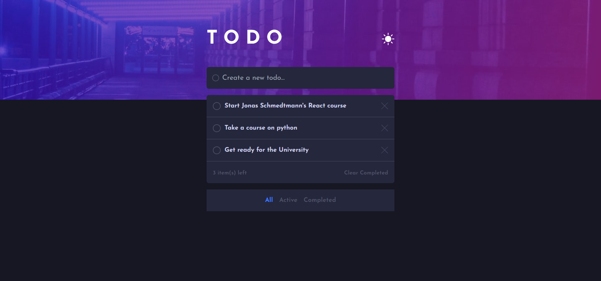

# Frontend Mentor - Todo app solution

This is a solution to the [Todo app challenge on Frontend Mentor](https://www.frontendmentor.io/challenges/todo-app-Su1_KokOW). Frontend Mentor challenges help you improve your coding skills by building realistic projects. 

## Table of contents

- [Overview](#overview)
  - [The challenge](#the-challenge)
  - [Screenshot](#screenshot)
  - [Links](#links)
- [My process](#my-process)
  - [Built with](#built-with)
  - [What I learned](#what-i-learned)
  - [Continued development](#continued-development)
  - [Useful resources](#useful-resources)
- [Author](#author)
- [Acknowledgments](#acknowledgments)

## Overview

### The challenge

Users should be able to:

- View the optimal layout for the app depending on their device's screen size
- See hover states for all interactive elements on the page
- Add new todos to the list
- Mark todos as complete
- Delete todos from the list
- Filter by all/active/complete todos
- Clear all completed todos
- Toggle light and dark mode
- **Bonus**: Drag and drop to reorder items on the list

### Completed

Users should be able to:

- View the optimal layout for the app depending on their device's screen size
- Add new todos to the list
- Delete todos from the list
- See hover states for all interactive elements on the page
- Mark todos as complete
- Toggle light and dark mode

### Not Completed

Users should be able to:

- Filter by all/active/complete todos
- Clear all completed todos

- **Bonus**: Drag and drop to reorder items on the list

### Screenshot

### Links

- Solution URL: [Add solution URL here](https://github.com/4002-Nonye/Todo-app)
- Live Site URL: [Add live site URL here](https://todo-app-sepia-kappa.vercel.app/)

## My process

### Built with

- [Tailwind css](https://tailwindcss.com) - CSS library
- [React](https://reactjs.org/) - JS library

### What I learned
- How to create and delete using React js
- How to manage state with the [useContext()] hook

If you want more help with writing markdown, we'd recommend checking out [The Markdown Guide](https://www.markdownguide.org/) to learn more.

### Continued development

- Theme switch (dark and light mode)
- Drag and Drop to reorder list
- Filter Completed and Non-completed todo
- Persist more features when site reloads

## Author

- Frontend Mentor - [@Nonye](https://www.frontendmentor.io/profile/4002-Nonye)
- Twitter - [@the_altekid](https://twitter.com/the_altekid)

